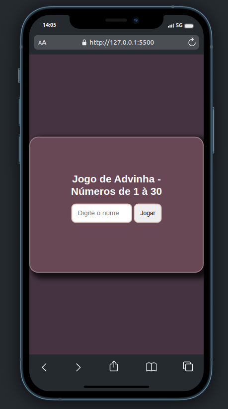
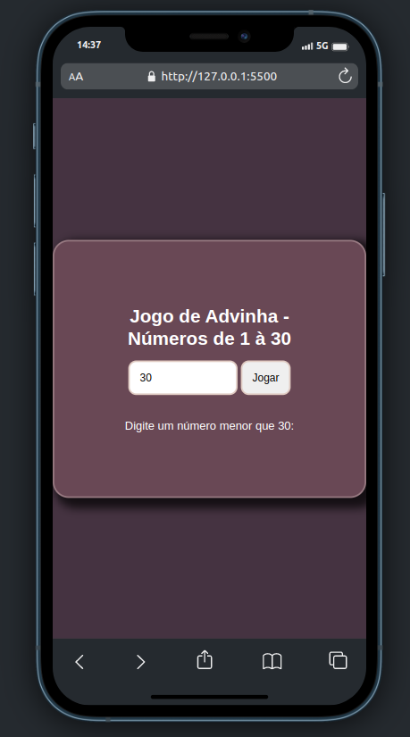
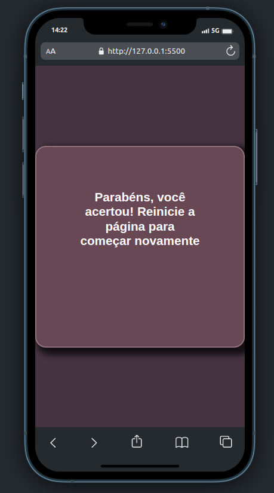

# Jogo de Adivinhação em JavaScript

---

### Descrição

Este é um pequeno jogo de adivinhação criado em JavaScript. O objetivo do jogo é adivinhar um número aleatório gerado entre 1 e 30. O jogador é solicitado a fazer uma tentativa, e então é informado se o número é maior ou menor que a sua tentativa. O jogo continua até que o jogador acerte o número.

<h1 align="center">
  
  
  

</h1>

---

### Requisitos

Este jogo foi criado com JavaScript puro e não requer nenhuma biblioteca ou dependência adicional. Ele pode ser jogado em qualquer navegador moderno que suporte JavaScript.

---

### Como executar o projeto

- Abra o navegador
- Execute o arquivo index.html
- Divirta-se com os palpites

---

### Autor

    
    
Jhony Alife

